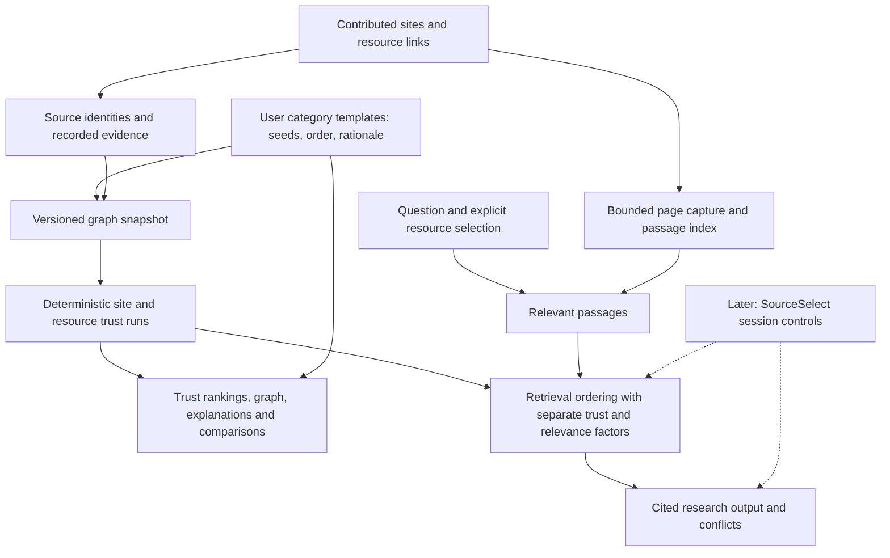

# TrustNode architecture and technical contracts

Implements the [canonical strategy](../Business/STRATEGY.md).
Current methods: pipeline `0.3.0`, ranking `retrieval-v1`, templates `seed-template-v1`,
graph computation `graph-trust-v1`, stored replay artifacts `trust-artifact-v1`.
Migration 012 implements stored runs locally; production activation is separate.

The sections through Canonical verification describe the existing implementation.
The [target architecture](#target-architecture-and-implementation-plan) defines
the full system; implementation status is recorded separately. Delivery order and
external dependencies live in [TASKS](TASKS.md#implementation-sequence).
For the implemented milestones and verification evidence, use the
[delivery ledger](TASKS.md#completed-work); do not infer delivery from this plan.

## Application

Next.js App Router on Vercel; Supabase Postgres, Auth, and Storage.
Pages: `/`, `/sources`, `/packs`, `/packs/:id`, `/explore`, `/verify`, `/charter`,
`/templates`, `/trust`, `/login`, `/signup`, `/account`, and `/auth/callback`.
Writes use the caller's bearer token and RLS. No app service-role key.
Private responses use `Cache-Control: private, no-store` and vary by authorization.
Missing database configuration/schema produces an explicit unavailable state.

## Authentication and user creation

User-facing authentication is SSO, with Google and Microsoft OAuth adapters.
Supabase Auth is the backend identity/session store. OAuth creates the user on
first successful sign-in (JIT) when project signup is enabled; returning identities
reuse their account. `/login` and `/signup` use the same provider flow; there is no
separate password or email-link signup form. Existing sessions remain compatible.
Enterprise SAML/domain SSO is not implemented by these OAuth adapters.

`GET /api/auth/providers` reads public Supabase Auth settings with a five-second
timeout and returns only enabled supported providers and signup readiness. Server Supabase clients and provider discovery fall back to the public env pair
when the server aliases are absent. No
management/service-role credentials, configuration secrets, or user records are
returned. Disabled providers are not presented as working buttons. Actual provider
credentials and redirect allowlists must be configured outside the app.

All browser surfaces share one Supabase client and session hook. OAuth uses PKCE
with automatic code exchange at `/auth/callback`; Microsoft requests the email
scope. Post-auth return destinations are restricted to known same-origin app pages.
Errors/cancelled flows return to sign-in. A first sign-in opens account onboarding;
optional display name and `onboarded` live in the user's auth metadata, never in an
authorization decision. Subsequent sign-ins return to the requested workflow.
Account sign-out revokes the local browser session; existing bearer-token/RLS
checks remain the authority for writes and private reads. Public pack attribution
continues to use account UUID, never email or mutable display name.

Provider setup references: [Google](https://supabase.com/docs/guides/auth/social-login/auth-google),
[Microsoft](https://supabase.com/docs/guides/auth/social-login/auth-azure),
[PKCE](https://supabase.com/docs/guides/auth/sessions/pkce-flow).

## Sources

`GET /api/sources`: public shelf; category/tag filters, title/excerpt search,
limit (maximum 100), offset, and stable created-time/ID ordering. The shelf UI
shows 25 rows per page, resets pagination on filtering, and offers retry on failure.
Search text does not currently match tag labels.
`POST /api/sources`: authenticated HTTP(S) URL contribution, exact-URL duplicate
response (409), best-effort metadata; contributor title/description take precedence.
`PATCH/DELETE /api/sources/:id`: owner operations. Shelf reads include public owner
UUID so only the owner sees edit/delete controls; bearer authentication and RLS
remain the actual authorization boundary. The editor updates title/description,
retains failed drafts across shelf filtering and confirms deletion. Editing these
shared details affects every pack using that source; curator notes/order are separate.
Source edits currently use last-save-wins, without pack-style revision tokens.
A foreign-key reference from a pack blocks deletion with a generic 409. Uploaded
storage is removed only after successful row deletion; cleanup failures are reported.
Category/tag editing remains API-only; title/description editing is on the shelf.

Migration 009 adds `tn_save_source`: a caller-RLS, SECURITY INVOKER transaction for
link creation, file registration and owner edits. Metadata, category and complete
tag replacement commit together or roll back. Omitted edit tags preserve membership;
an empty list clears it. Categories resolve only to shared public categories, never
a private curator's matching slug. Source identity/ownership/file fields cannot be
updated by callers. Global tag labels are immutable; source-tag attachment requires
source ownership. An exact-link-URL unique index handles concurrent duplicates.
Database bounds cover title, excerpt, extracted text, errors, URL and tags. These
CHECK constraints use NOT VALID to preserve legacy rows while enforcing new writes.

Migration 010 also enforces kind/URL/file-path/MIME invariants on the table itself,
closing the direct-INSERT bypass of RPC validation. Links require HTTP(S) URLs
without credentials/whitespace and no file fields. Files require a safe storage
path under their owner's UUID, a filename and supported MIME, with no link URL.
NULL inputs cannot bypass these checks. Account deletion may clear attribution
without removing the public source. Existing rows remain readable; new writes and
updates must satisfy the constraint. URL shape validation does not fetch or verify
the site's contents; network destination checks remain in the fetch adapter.

Uploads accept PDF/text/Markdown/CSV/JSON, maximum 4 MiB. Both the API and bucket
enforce the size/MIME allowlist; storage inserts require the caller's UUID folder.
Extracted text has a 200 KB character cap, separate from the contributor excerpt.
Extraction failures retain a generic reason. Storage and Postgres cannot commit
as one transaction: an explicit database rejection triggers file cleanup; an
ambiguous RPC failure preserves the file in case its source row committed. Failed
cleanup and uncertain saves can leave orphans for administrative reconciliation.

Link metadata fetch accepts public HTTP(S) on standard ports, without credentials.
Each connection uses validated public DNS addresses directly, including after each
of at most three redirects. The entire fetch has an eight-second deadline and a
600,000-byte streaming cap; only uncompressed HTML/XHTML/plain text is read. Failed
fetches fall back to contributor context; fetched descriptions are not versioned
passages or verified quotations. JSON request bodies are bounded (32 KiB for source
writes/retrieval, 4 KiB for verification), and multipart bodies allow 4 MiB plus
32 KiB of form overhead. Shared rate limits remain pending.

## Source packs

`GET/POST /api/packs`, `GET/PATCH/DELETE /api/packs/:id`. A pack has title (1–120 characters),
description (up to 2,000), topic (1–80), up to ten tags (1–40 each), public/private
visibility, and 1–50 unique existing link sources with ordered ranks and notes
(up to 1,000 characters each). Owner attribution uses account UUID, never email.

Migration 003 creates `tn_packs`, `tn_pack_sources`, and `tn_create_pack`.
Creation is atomic, SECURITY INVOKER, and governed by caller RLS. Packs default
private. Anonymous users see public packs only; owners also see their private packs.
Source records themselves remain public. Copies create independent packs, private
by default. Fork ancestry is specified below; topic browsing and comparison use the same visible records.
Lists return up to 50 visible packs; source selection searches up to 100 shelf rows.
Production migration activation is tracked separately from code deployment.

Migration 004 adds owner editing/deletion with `tn_update_pack` and `tn_delete_pack`,
both SECURITY INVOKER under RLS. PATCH replaces the full pack and ordered entries
atomically; DELETE removes the pack and its entries, preserving shared sources and
independent copies. Both requests require the `revision` captured when editing or
confirming deletion begins. A locked parent row prevents concurrent writes through
these functions from silently overwriting each other: stale revision returns 409;
missing/non-owned pack returns generic 404. Metadata and direct entry writes advance
revision, an opaque concurrency token; caller updates cannot change identity or ownership.
The editor retains failed drafts, offers explicit discard/reload after a conflict,
and confirms permanent deletion. Before migration 004, existing pack reads
remain supported and owner editing is labeled unavailable.

Migration 008 removes explicit anonymous EXECUTE grants on the original create,
update and delete RPCs. Supabase's default grants can assign privileges directly
to `anon`, which revoking `PUBLIC` alone does not remove. The functions already
checked authentication; the repair also enforces that boundary at the privilege
layer, preserving authenticated execution and existing ownership/RLS checks.

## Fork ancestry (migration 005)

POST `/api/packs` optionally accepts `fork_of: {id, revision}`. New drafts/copies
remain independent and private by default. Revision is captured when copying,
never silently refreshed while the draft is open. Hidden/deleted parent returns
generic 404; changed parent returns 409 and preserves the draft. Before 005,
ordinary creation/reads remain usable; attributed copies report unavailable rather
than silently saving without ancestry. Legacy copies cannot gain invented ancestry.

`tn_pack_origins` stores child, parent, captured revision and fork time, without
snapshot titles/owners. No caller writes; origin is immutable. RLS reveals the row
only if the viewer can currently read both packs. Parent deletion cascades only to
this origin row, not the child. Detail responses resolve current parent title/owner
under caller RLS; private, deleted, and absent ancestry return no visible origin.
Detail responses expose `origins` and the first visible `origin` for compatibility,
without a hidden-parent count or inaccessible IDs.
Current parent metadata is labeled as such, not a historical content snapshot.

`tn_fork_pack` atomically validates/locks the visible parent, checks revision,
creates the caller-owned child and origin, and validates link-only entries. This
narrow SECURITY DEFINER function is needed to lock another owner's public pack
without broadening owner-update RLS. It has a fixed search path, authenticated-only
execution, explicit auth/visibility checks, and no caller-supplied child owner/ID.
It cannot edit the parent or an existing child. Invalid entries roll back both
child and origin. Ancestry is provenance of the starting pack, not an assertion
that the edited copy agrees with it, and never affects ranking/confidence.

## Topic browsing and pack comparison

Pack topics may be curator-defined paths separated by `>`, for example
`Security > OAuth > PKCE`. Existing flat labels remain valid. Browsing normalizes
case/whitespace for matching and includes descendants when selecting a parent;
this is a navigation convention, not a centrally governed authority taxonomy.
Search matches pack title, description, topic and tags. Filters/counts cover only
the newest 50 caller-visible packs returned by the existing list API.

Comparison loads both details afresh through caller RLS and displays shared/unique
source records, each curator's rank and notes, owner, visibility and revision.
Source identity is the source record ID, not a fuzzy title/URL match. A differences
filter highlights membership, rank and note differences. Refresh rechecks access;
failed/hidden pack reads clear the previous comparison. Account/token changes
remount the comparison so private results cannot persist into another session.
Comparison itself is read-only. Signed-in users can select up to 50 unique sources
and either curator's note, then review/reorder/edit an independent private draft.
Existing drafts must be saved/discarded before starting a merge.

## Two-parent merge (migration 006)

POST `/api/packs` accepts `merge_of: [{id, revision}, {id, revision}]` instead of
`fork_of`. Exactly two distinct parents are required. Both revisions are captured
from the comparison used to start the draft. `tn_merge_pack` locks readable parents
in stable UUID order, checks both captured revisions, reuses constrained fork
creation, and records the second immutable origin in the same transaction. Any
failure rolls back the whole save. Missing/private parent returns generic 404;
changed parent returns 409 and retains the draft. Before 006, a merge fails as
unavailable, never silently saving without both origins.

006 changes the origin primary key to `(pack_id, parent_id)`; existing single-parent
forks and their function remain valid. Existing RLS applies independently to each
origin. Hiding/deleting a parent removes only that attribution from a reader's view,
not the other visible origin or the independent child. No stored total or merge-kind
flag reveals hidden ancestry. Source membership/order/notes remain curator choices;
merged provenance never changes canonical confidence or retrieval formulas.

## Category seed templates (migration 007)

`tn_sites` identifies an exact lowercase host; `tn_sources.site_id` and
`normalized_url` are database-derived on every source write. Normalization removes
default ports/fragments, preserving scheme, path and query. The contribution API
already serializes WHATWG URLs/IDNA; unsupported legacy URLs retain no site identity
rather than being guessed. Files never inherit their storage host. Alias review,
publisher boundary corrections and fetched-content identity remain future work.

Pack category paths map to stable hierarchical records. Existing public categories
remain shared; other paths are scoped to their curator, with normalized `path_key`.
RLS reveals a curator's category/ancestors only to that curator or through a currently
visible pack. Equal labels from different curators do not merge automatically.
Backfill preserves source/pack IDs and deliberately advances existing pack revisions
once, so any draft opened before migration must reload before saving.

`GET/POST /api/packs/:id/versions` reads or captures `tn_pack_versions`. Capture
requires ownership, the expected pack revision, 1–50 ready identified link seeds,
and a rationale for each. A narrow authenticated SECURITY DEFINER function locks
the pack and source rows, validates membership and assembles the snapshot from DB
records. Clients cannot write snapshots or spoof site identities. Repeating an
identical capture returns its existing ID and SHA-256 content fingerprint.

The immutable `seed-template-v1` JSON records category identity/path, pack metadata,
revision, all members/order/notes, source/site identities, explicit seed flags and
rationale. `uniform-seeds-v1` assigns equal raw resource weights;
`ordered-seeds-v1` uses `1 / chosen_seed_position`. Site weights use the maximum
raw weight per site before normalization, preventing duplicate pages from boosting
that site's mass. These are declared seed preferences, not computed trust scores.
`accepted-edges-v1` names the future graph policy; no evidence is inferred or fetched.

Pack details expose seed editing, weight preview, version selection, direct links
and JSON export. GET lists the latest 20 versions or a specific `?version=UUID`.
Reads and versions follow the pack's current visibility; deleting the pack cascades
to its versions. Later pack/source edits do not rewrite captured contents. Capture
conflicts return 409 and retain choices until explicit reload. Legacy pack copy/merge
flows still copy pack members. The selected-version fork below preserves seeds;
the selected-version merge explicitly reconciles multi-parent seeds and evidence.

## Independent template forks (migration 013)

`GET /api/templates/:version/fork` reads an accessible version's content hash,
evidence revision, visibility epoch, current evidence/accepted counts and visible
starting-version attribution. `POST` takes those captured tokens, an explicit
`copy_evidence` choice, a title and a caller-generated `request_key`. One transaction
locks current parent visibility against edits, deletion and evidence mutations,
then creates a private caller-owned pack and immutable child template. A later
parent pack/source edit cannot substitute for the selected version. The selected
source entries, order, notes, seed mode and rationale are copied exactly; the child
has its own owner, category identity, pack revision and content hash. A missing
source fails the transaction rather than silently dropping a member.

Seeds-only forks create no evidence. Opting into evidence copies all current
revisions (including rejected/proposed/conflict relations), bounded to 200 records
and 2 MiB; the preview states counts and limits. Each gets a new child edge and
revision, a permanent `creation_kind=template-import` label, and the local importer
as the person responsible for that proposal. No reviews, decisions or acceptance
events are inherited. The importer can revise it; the child curator must review
and accept the child revision before it propagates authority. Local changes and
recomputation never alter the parent. Generic 404/409/422 responses distinguish
unavailable scope, changed tokens and copy limits without disclosing hidden data.

`tn_template_origins` and `tn_edge_origins` store attribution separately from
independent content. Caller RLS requires both sides to remain accessible. Original
revision/author links are resolved only in current reads and disappear when the
parent is hidden or deleted. A cascade deletes only the attribution row, never
the child. The import label remains visible. Parent IDs/authors are not copied
into child snapshots or evidence bodies, and run capture reads base evidence rows
without dynamic attribution. Thus a frozen child export cannot preserve hidden
parent identifiers. Already-copied resource text and quotations remain independent
content; making the parent private does not retract copies or previous downloads.

Request keys serialize duplicate submissions. An identical retry returns the same
caller-owned child even if the parent has since disappeared; changed payloads
return 409. A deleted child leaves an inaccessible request tombstone so retry
cannot recreate it. The UI retains the exact request on ambiguous failures, aborts
on account/version changes, and links success to child evidence review and the
existing trust workspace. Broader discovery and adoption remain subsequent work.
Migration 013 is additive and not yet applied live.

## Selected-version merge reconciliation (migration 014)

The merge accepts two versions from different packs, each with content hash,
evidence revision and visibility epoch. Both parent packs are locked in UUID order
before checking the captured tokens. A private owned child is created only after
all reconciliation and bounded-copy checks pass. Retries use a caller-scoped key
and payload digest; deleting a child leaves a tombstone. Parent changes after a
successful request cannot invalidate a retry that only returns the caller's child.

Each resulting member explicitly selects a parent's captured source metadata.
The ordered member array supplies the new ranks; seed membership and rationale
are independently chosen, with one explicit equal/ordered seed policy. Seed mass
is recalculated from those choices, never added across parents. One selected
parent supplies category, description and tags; the new title belongs to the child.
The UI requires conflicts and resulting order/policy to be reviewed before saving.

Evidence copying is optional. Current revisions from both parents are eligible
only when both endpoints are included. Combined inputs are bounded to 200 records
and 2 MiB. Identical evidence bodies are copied once after binding URLs/site IDs
to the selected child entries; distinct assertions remain separate proposals.
The graph's existing directed-pair deduplication prevents multiple supporting
records from manufacturing extra rank after local acceptance. No reviews transfer.

Migration 014 extends the existing template/evidence origin tables to multiple
parents per child. Each origin remains independently filtered by current RLS;
no hidden-origin count is exposed. Copied content and run exports contain no parent
identifiers. Parent deletion removes its origin rows and leaves the child intact.
The API, UI and checks reuse the 013 fork and existing review/run boundaries.
The local merge/review/recompute/compare workflow and hosted PostgreSQL concurrency
checks passed; delivery evidence is in TASKS. Migration 014 is not applied live.

## Saved-template discovery (migration 015)

`/templates` and `GET /api/templates` list immutable saved versions across all
currently accessible packs. Each row identifies the current attributed owner,
captured revision/category, seed choices/rationale, schema and edge policy, member
and mapped-site coverage, and separately visible starting versions. Links pin the
selected version for inspection, fork/merge entry and the trust workspace. This is
template discovery; it assigns no template trust score or reference-based ordering.

`tn_discover_templates` is a read-only SECURITY INVOKER RPC. Caller RLS filters
versions, provenance and runs before any returned data or pagination decision.
Category paths match the captured normalized path and descendants, not the current
mutable draft; matching labels do not merge curator identities. Newest captures
sort by `(created_at DESC, id DESC)`, 12 per page by default, maximum 25. An opaque
cursor preserves PostgreSQL microseconds and the last returned visible ID, bound
to the normalized category. One accessible lookahead row supplies `next_cursor`;
no hidden-row cursor or global template count is emitted. This is keyset browsing,
not a frozen catalogue: refresh restarts at the newest currently visible versions.

Public adoption is displayed **per resource**, never summed into a template score.
It uses the existing `retrieval-v1` exact-URL association and best reciprocal pack
rank per curator (at most 1 per curator, 2 total), rounded to four decimals. Scope
is explicitly the newest 200 public packs, with deterministic time/ID ties and
their public count. Owner-visible private packs cannot affect that scope or its
totals. Multiple versions of one pack are not additional adoption. The discovery
query neither reads graph scores for adoption nor writes graph inputs/results.

A card links the newest currently readable published completed run when one
exists, otherwise the caller's newest accessible completed run. It shows the
stored methodology, timestamp, stale flag and separate site/resource evidence
states (including seed-only); it does not substitute an aggregate score. With no
accessible completed run, it says so without exposing unpublished run existence.
Current visibility epochs and existing run RLS control these reads. Account changes
remount the view; category/page changes abort old requests; refresh/focus rechecks
access and clears previous cards. Responses remain private/no-store.
Migration 015 is staged; production activation is separate.

## Independent-reference comparison (migration 016)

The optional comparison in `/templates` requires an explicitly selected accessible
completed run. It makes no automatic reference/canonical designation. Without a
reference, the existing chronological discovery/adoption view remains unchanged.
`GET /api/templates/compare` pins the run ID, input/output hashes, captured algorithm
and `median-site-authority-v1`. Migration 016's SECURITY INVOKER RPC reads complete
stored **site** masses and an authorized candidate cohort in one statement snapshot;
it never recomputes a graph or feeds adoption into graph inputs.

Scope is the newest **50 accessible saved versions** in the captured category path
and descendants, ordered by capture time/UUID. Current RLS/category filtering and
exclusion of every version from the reference run's pack happen **before** taking
50. Excluding the same pack prevents self-scoring; it is not proof of independent
evidence or independent curators. A visible lookahead says whether more candidates
exist; this is explicitly not global category ranking.

The metric deduplicates each candidate's recorded site identities, looks up their
raw masses in the frozen reference vector, and takes the median of known values.
For an even count, use the arithmetic mean of the middle two. A known zero remains
zero; an absent site is unknown and excluded from the median. Zero known sites
produces a null/unscored median. Coverage is known sites / **all distinct recorded
site identities** in the selected template; members lacking site identity are
counted separately. Rank the full cohort by median descending, then version UUID
ascending; unscored candidates follow scored ones, also by UUID. Pages contain 12
rows. This describes selected sites on a reference graph, not factual accuracy or
a candidate's own graph result. Category identities/paths are shown and differences
labeled; candidate seeds, accepted evidence and graph scope are never assumed equal.

A scope fingerprint binds the reference ID/hashes/algorithm/visibility epoch,
metric, normalized category, chronological candidate IDs/content hashes/current
visibility epochs and the bounded lookahead flag. Every page and export rechecks
reference and candidate RLS and recomputes that fingerprint. A changed cohort or
visibility epoch returns 409/restart rather than silently substituting rows;
inaccessible reference returns generic 404. Cursor bindings retain reference hash,
metric, category, fingerprint and offset. No persistent comparison cache is used.
Account/reference/category changes abort old requests; refresh/focus reauthorizes
and clears prior results. A failed export also clears the displayed comparison.

`GET /api/templates/compare/export` requires the selected input hash and scope
fingerprint, reauthorizes them, then returns all cohort rows (not merely the visible
page) as `template-reference-comparison-v1`. It records reference IDs/hashes and
algorithm, metric, scope limit/selection/ordering/fingerprint, per-template coverage
and each site's known mass or null. All responses are private/no-store. Revocation
prevents subsequent reads/exports; previously downloaded files cannot be recalled.
Migration 016 is staged. Production activation and real-provider acceptance remain
separate from local functionality.

## Evidence relationships (migration 011)

Saved template versions now own manual proposals in `tn_source_edges`, append-only
`tn_edge_revisions`, and append-only `tn_edge_reviews`. Every proposal references
two distinct members of that exact version, which supplies their URLs/site IDs
and category scope. The author supplies relation, observation date, rationale,
locators and quoted evidence. Non-citation relations also require claim scope and
a locator for the second source. These are attributed assertions, not automated
link observations or independently verified page captures.

Any signed-in reader can propose evidence or challenge a revision. Only the
proposal author can revise it, supplying the previous revision ID; stale edits
return 409. Only the template owner can accept/reject/withdraw evidence or resolve
challenges. Acceptance requires explicit evidence review and a source quotation
(both quotations for non-citation relations). Decisions target the latest revision
and include the last decision ID to reject stale reviews. New evidence revisions
start unaccepted; earlier decisions remain attached to their original revision.
Challenges require evidence and remain separate from acceptance. A challenge gets
one recorded uphold/dismiss resolution; changing acceptance requires a separate
decision. No scores are written by any of these operations.

Mutation RPCs are narrow SECURITY DEFINER functions with fixed search paths,
authenticated-only grants, current visibility/ownership checks, and row locks.
Direct table mutations are revoked. An internal helper locks the pack's current
visibility during writes and cannot be called by app roles. RLS follows current
template visibility through every history layer, including for proposal authors.
Deleting the pack removes its versions and evidence histories. Selected-version
forks can create independent imported proposals under 013, but never inherit
decisions. Reference-policy maintainer roles
and publication remain unbuilt; current decisions belong only to user templates.

`GET/POST /api/relationships` lists or proposes/revises evidence for
`template_version`; writes send `template_version_id`, optional `edge_id` and
`previous_revision_id`, plus `evidence`. Lists return 20 summaries per page with
current revision/decision. `GET /api/relationships/:edge_id` independently pages
20 revisions and 20 review events using `before_revision`/`before_review` cursors.
`POST /api/relationships/revisions/:revision_id/reviews` records decisions,
challenges and resolutions. Reads are private/no-store even for public templates.
The saved-template view exposes proposal/edit/review forms and inspectable history;
failed saves retain drafts. Account/version changes remount the evidence view.

## Retrieval

`POST /api/retrieve` accepts `query` (1–500 characters), `limit` (1–20, default 6),
`use_pack_signals` (boolean, default true), and optional `pack_id` (UUID).
Invalid input: 400. Inaccessible selected pack: generic 404. Invalid private-selection
token: 401. Unavailable selected-pack storage: 503.

Candidates require normalized term overlap. `retrieval-v1`:

```
relevance = 5 × distinct matched query terms / distinct query terms
seeded trust = 2 × clamp(analyst weight, 0, 10) / 10; community = 0
pack influence = min(2, sum per distinct public curator of best(1 / rank))
supersession penalty = 1 when explicitly superseded, otherwise 0
score = relevance + seeded trust + pack influence − supersession penalty
```

Factors round to four decimals, with stable ID ties and ordered summation.
Repeated terms do not inflate overlap. Multiple packs from one curator contribute
only that curator's best rank. This is a bounded curation signal, not Sybil resistance.
Private packs restrict their owner's candidate set but never feed public adoption.

Read limits: newest 200 ready community links, newest 200 public packs, at most
50 selected-pack entries. Report limits, counts, unavailable layers, and warnings.
Exact URL equality associates shelf entries with seed provenance. Duplicate URLs
prefer the seed representative. Explorer excludes illustrative `.invalid` URLs.
Public exploration can fall back to seeds when optional database layers are unavailable.

Results include numeric factors, matched terms, derivation, pack provenance,
controls, corpus status, and independent `canonical_verification`. Retrieval rank
is not factual confidence. Unmatched research topics say “No analyzed claim match.”

## Canonical verification

The community read uses at most 200 ready sources, ordered by creation time then
ID, and only title/excerpt metadata. Full extracted documents are not loaded by
this public endpoint. Community entries retain zero earned confidence weight.

`POST /api/verify {claim}`: public and CORS-open; string of 1–500 trimmed characters.
Malformed/empty/oversized requests return 400. Supabase is optional for seed verification.
`PIPELINE_VERSION` in `app/src/trustnode/version.ts` is the version source of truth.

Pipeline: normalize → retrieve → stance → conflicts → confidence.
Normalization uses deterministic tokenization, stop-word removal, and simple stemming.
Stance patterns use token overlap; winning pattern has most hits, with threshold
`min(2, pattern count)`. Negation within four raw words of a matched keyword
mechanically flips supports/contradicts, preserves qualifies, and labels the result.
This heuristic is limited; it is not semantic understanding.

Seeds and supplemental community results are selected independently, up to `topK`
each (default six, thus up to 12 returned). Only seeds affect canonical confidence,
conflicts, or staleness. Community earned values are forced to zero. Votes and pack
controls never alter canonical results. Seed confidence:

```
support = min(1, sum(supporter earned / 10) / 2)
contra = min(1, sum(contradictor earned / 10) / 2)
stale = 0.2 if any relied-upon seed is superseded, otherwise 0
confidence = round(100 × clamp(support × (1 − 0.6 × contra) − stale, 0, 1))
```

Levels: 80+ well supported; 50+ partially supported; 20+ contested; otherwise
unsupported. Formula and evidence remain inspectable. Contradictions precede the
evidence chain. Standards do not expire by age alone. The current canonical corpus
is an OAuth/PKCE prototype and still contains illustrative fixtures and sample votes.
Do not claim general-domain verification or measured historical reliability.

## Target architecture and implementation plan

Architecture revision `plan-1`, 2026-09-21. This implements Strategy and Alex's
priority: transparent trust ranking first, RAG second, granular controls last.
The original design at Git commit `6bbc811` already described category-specific
PageRank/TrustRank, public seed sets, recorded conflicts and deferred controls.
This plan supplies missing contracts and adapts that design to today's packs,
SSO, ownership and privacy. Historical agent assignments and approval gates do
not apply. Strategy stays locked. Numerical defaults below are proposed initial
methodology, to be versioned when implemented; none is an empirical accuracy claim.

### 1. Product boundaries and end-to-end flow

TrustNode computes and explains the standing of sites and resources within a
category and a declared trust policy. A category template is a user's versioned
source pack plus seed choices and graph policy. Users can publish, inspect, fork,
compare and independently modify these templates. RAG consumes a chosen template
and its trust run. SourceSelect exposes the results and, later, session controls.

| Signal | Inputs | Depends on the question? | Meaning |
| --- | --- | --- | --- |
| Graph trust | Category, seed distribution, accepted relationships, policy version | No | Relative authority under the declared graph and seeds |
| Community curation | Attributable pack membership/order and distinct curators | No | Observed preference/adoption, displayed separately |
| Retrieval relevance | Question and stored passages; later optional embeddings | Yes | How well the passage addresses the query |
| Claim evidence/confidence | Specific supporting and conflicting evidence plus a versioned evaluation method | Yes | Evidence assessment; never a renamed PageRank score |



The trust browser must work before a question is typed or an LLM is configured.
Changing the query must leave its pinned trust run unchanged. Changing a seed or
accepted relationship produces a new run, with an inspectable explanation of the
difference. A private/custom template is a declared perspective; publishing it
does not make it the canonical policy for everyone.

### 2. Existing foundation and missing components

| Component | Reuse | Remaining work |
| --- | --- | --- |
| Identity | Shared Supabase SSO/JIT and caller JWT | Activate providers; verify real identities |
| Curation | Sources, packs, revisions, immutable seed versions (007), independent forks (013), reconciled merges (014), category discovery with separate resource adoption (015) | Production activation and real-account acceptance |
| Topics | Curator-scoped category hierarchy and captured category membership (007) | Reviewed shared taxonomy and cross-category relationships |
| Source authority | Exact-host site identity (007), site/resource computation, stored runs, discovery and explicit bounded independent-reference comparison (016) | Production activation and real-category evidence |
| Evidence review | Versioned relationships, curator decisions and challenges (011) | Versioned page captures and reference-policy maintainer publication |
| Retrieval | `retrieval-v1` and pack filtering | Passage index, selected subsets and pinned trust-run input |
| Operations | Next.js/Vercel, Supabase; bounded Postgres jobs and restricted graph worker (012) | Production worker credentials/host and migration activation |

Production migration/auth activation is a separate dependency. Existing source
descriptions, illustrative seed quotes and pack membership must not be migrated
as proven page content, observed citations or measured reliability.

### 3. Identity, categories and category templates

**Site and resource are distinct identities.** Add `tn_sites` for a normalized
host and keep `tn_sources` as the addressable resource. Normalize host case/IDNA,
remove URL fragments and default ports, and preserve path/query semantics.
Do not merge HTTP/HTTPS resources or remove query parameters without recorded
evidence. Redirects and canonical tags propose aliases; they cannot silently
transfer authority. Version any accepted alias/site-boundary decision.

Initially a site boundary is an exact host. Do not automatically merge `www`,
subdomains or multi-tenant hosts. Publisher/platform boundaries can be corrected
through reviewed mapping records, producing new snapshots. Files without a
verified publishing site have no site score; never attribute them to Supabase's
storage hostname. Imported files retain their resource identity and provenance.

Extend `tn_categories` with stable parent relationships and normalized paths.
Map current flat categories and pack paths without changing existing URLs or
ownership. Similar labels must not silently merge different concepts. Category
membership is explicit and attributable; text matching alone does not assign
authority. Parent browsing can include children, but a trust run includes only
the category scope declared in its snapshot. No automatic cross-category trust.

Extend packs rather than introducing another competing collection system:

- A mutable pack remains the user's draft/current collection. Atomic saves and
  existing revision tokens continue to protect editing.
- `tn_pack_versions` captures immutable entries, order, notes, category, seed flags,
  seed weighting mode, inclusions/exclusions and policy version. Publication or
  running a template captures a version in one transaction against the expected
  pack revision. Existing revision integers are concurrency tokens, not history.
- Membership and seed status are separate. Existing links migrate as members;
  no historical pack is silently promoted into a seed policy. The curator chooses
  seeds and supplies rationale. Other members can earn rank through graph links.
- Reference category policies use equal seed mass initially. User templates may
  select the named `ordered-seeds-v1` mode: raw seed weight `1 / seed_position`,
  normalized to sum to one. The UI shows the resulting weights. General pack
  ordering remains curation; only explicitly marked seeds affect this vector.
- For the site projection, multiple seed resources on one site contribute only
  that site's highest raw seed weight before normalization. Adding many pages
  cannot manufacture extra site seed mass. Resource projection seeds stay distinct.
- A fork copies the selected version into a new independent draft with visible
  ancestry only where allowed. A merge requires explicit seed/policy reconciliation;
  it cannot silently combine two trust policies. Saving produces a new version.

Anyone can create their own template. Only a recorded maintainer publication can
label a policy the project's reference policy. Neither curator identity, adoption,
nor a reference label is a certificate that every source is factually correct.

### 4. Relationships, evidence and governance

Store immutable relationship revisions with source/target, category, relation,
rationale, contributor, evidence locator, asserted/observed date and superseded
revision. A separate append-only decision record says which policy accepted or
rejected that revision, by whom and why. Editing evidence creates a new revision.

| Relationship | Direction and required evidence | Effect in graph-trust v1 |
| --- | --- | --- |
| `cites` | A resource points to B; retain the passage/URL locator proving the citation | Accepted citation can pass authority A → B; raw hyperlink observation alone cannot |
| `corroborates` | A provides evidence supporting a particular statement in B; retain both evidence locators and claim scope | Accepted relationship passes authority A → B; reciprocal support requires a separate supported record |
| `contradicts` | A disputes a particular statement in B; retain scope, date and both sides | Display conflict; no negative PageRank edge and no blanket site penalty |
| `supersedes` | New resource A replaces old resource B within a stated scope | Mark B's applicable evidence superseded; link to A; no automatic score transfer in v1 |

Citation is not agreement. A negative citation belongs in the conflict/evidence
view and is excluded from authority propagation by the policy decision. Automated
HTML extraction produces observations, not accepted relationships. LLM extraction,
when added, produces labeled proposals; it cannot approve an edge or set a weight.

Start with manually evidenced relationships so the core engine can ship without
a crawler. Each accepted locator must have enough captured evidence for review;
unverified notes remain proposals. Later ingestion attaches immutable page-version
and passage IDs to observations without rewriting earlier assertions.

The initial policy uses weight 1 for each eligible directed pair. Repeated
citations, multiple supporting records and duplicate curator submissions do not
stack weight. Support records remain inspectable even when deduplicated in the
matrix. Future edge-weight policies require a named methodology version.

Template owners decide which proposals enter their own policy. Project reference
policies accept only decisions by DB-authorized maintainers. Roles live in a
protected membership table, never editable auth metadata. Any signed-in user can
submit a challenge with evidence; a challenge does not silently mutate a score.
Resolution records and subsequent runs show the effect. Moderation can withdraw
abusive content without assigning it a factual trust value.

The older design proposed transferring all predecessor score on supersession.
This plan deliberately excludes that operation: it could double-count or move
authority without evidence of equivalent scope. A successor earns graph rank
through seeds/accepted edges. Transfer can be a later separately specified policy.

### 5. Deterministic trust engine

Implement a pure TypeScript module in `src/trustnode/graph/`, separate from
`ranking.ts` (retrieval) and `pipeline.ts` (canonical demo verification).
Input: one immutable category graph snapshot, one template version and a complete
algorithm configuration. Output: scores, convergence data and contribution ledger.
No network, database, clock, user identity lookup or model calls inside computation.

Run the same algorithm over two explicit projections:

- **Site graph:** collapse accepted resource edges to their recorded site IDs;
  exclude same-site edges and retain one directed edge per site pair. This is
  the primary site authority ranking. Resource/page volume is not a multiplier.
- **Resource graph:** use resource nodes and deduplicated directed resource pairs,
  excluding self edges. Display this score separately; internal citations may
  affect resources but never feed back into the site graph's authority.

Both projections use only the snapshot's category members and accepted edges.
An out-of-scope target is recorded as excluded, not silently added to the graph.
Neither projection uses search queries, traffic, votes, paid placement or an LLM.

Implemented `graph-trust-v1` is seeded personalized PageRank. For nonnegative seed
vector `p` summing to 1, outgoing-normalized matrix `P`, damping `d = 0.85`:

```
t(0) = p
D(k) = sum(t_i(k) for nodes i with no eligible outgoing edge)
t_j(k+1) = (1-d)*p_j + d*sum_i(t_i(k)*P_ij) + d*D(k)*p_j
residual = sum_j(abs(t_j(k+1) - t_j(k)))
```

Stop at residual ≤ `1e-6`, with a 100-iteration cap. Reject invalid weights,
missing referenced nodes, duplicate identities and an empty/zero-mass seed set.
Never substitute uniform seeds silently. Redistribute dangling mass to `p` to
preserve total mass. No-edge graphs return the seed distribution with a prominent
“seed-only; no propagated evidence” state. Unreachable nonseeds may have zero
mass; distinguish that from missing data or a failed run.

Sort nodes/edges by stable identity; specify ordered summation and pinned runtime.
Compute using float64 without rounding between iterations; persist raw values and
canonical output rounded to 12 decimals. Display ties break by stable node ID.
The public result hash covers deterministic inputs/outputs, excluding timestamps
and job IDs. Cross-runtime replays must meet numerical tolerance; byte-for-byte
replay is promised only for the recorded implementation/runtime and serialization.
If the iteration cap is reached, retain diagnostics but do not promote it to the
current completed ranking. Never serve a partially calculated run as finished.

Store raw mass and a display index `10 * t_j / max(t)` rounded to one decimal.
Label it **relative graph authority**, not a probability, confidence or historical
accuracy. Display values are comparable only within the same run/projection.
Coverage, node/edge counts, seed concentration and exclusions accompany rankings.

Each score explanation gives the exact final update components: direct seed mass,
incoming contribution per accepted edge, dangling redistribution and total. Store
the previous iteration vector so these contributions reproduce the returned final
vector exactly before presentation rounding. Show the largest contributions plus
an explicit remainder; downloadable data includes all contributions. Explain seed
dependence through per-seed component runs on demand: split initial/teleport mass,
hold the original run's full dangling distribution fixed, and use the same fixed
iteration count so components add back to the total. Cache by input hash. Do not
invent “top paths” by summing cyclic
walks as if they were independent evidence.

Personalized PageRank is the mathematical starting point, not proof of factual
reliability. The original [PageRank paper](https://research.google/pubs/the-anatomy-of-a-large-scale-hypertextual-web-search-engine/)
and [TrustRank research](https://www.vldb.org/conf/2004/RS15P3.PDF) inform this choice;
the category, governance and explanation policies here are TrustNode design choices.

### Implemented computation boundary (step 3)

`app/src/trustnode/graph/` has no DB, network, clock or model dependencies:

- `projectTemplate` consumes one captured template plus **all current relationship
  summaries from that version**. It creates independent site/resource matrices and
  seeds, preserves supporting revision/decision IDs, and reports excluded evidence.
  Duplicate support remains inspectable but contributes one unit-weight pair.
  Out-of-scope endpoints are recorded as excluded; a missing endpoint supplied
  directly to `computeTrust` is malformed input and is rejected.
- `computeTrust` pins methodology `graph-trust-v1`, implementation
  `graph-trust-v1.0.0`, damping 0.85, tolerance 1e-6 and 100 iterations. Parameter
  changes require a versioned method, not an unrecorded caller override. It sorts
  nodes/pairs by code-unit identity, accumulates each `d * previous / outdegree`
  contribution in that order, and adds direct seed, incoming total, then dangling
  mass. It returns raw/12-decimal scores, a separate 0–10 display index, previous
  vectors, residual/mass diagnostics and seed concentration (sum of squared seed
  masses). Ranking uses descending raw mass with stable ID ties.
- `computeSeedComponent` splits only initial/teleport seed mass, retaining the full
  original dangling distribution and the parent run's iteration count. Components
  add to the original result within float64 precision. `largestContributions`
  supplies the requested leading inputs plus an explicit remainder; full scores
  always retain every edge contribution.
- `serializeProjection` preserves exact input numbers in stable JSON;
  `serializeTrustResult` rounds canonical output numbers to 12 decimals. Raw results
  remain available. Step 4 must hash the **complete frozen snapshot envelope**,
  algorithm/runtime identity and canonical results, not just one matrix. Runtime
  recording, hashes and artifact persistence are implemented by the step 4 adapter.

Bounds are 1,000 nodes, 10,000 eligible pairs per projection and 10,000 current
relationship records including duplicate/excluded evidence. Over-limit inputs
fail without sampling. Duplicate/conflicting identities, invalid weights, mixed
version evidence, decisions attached to old revisions and zero seed mass fail with
structured error codes. Challenges/resolutions are not acceptance decisions.
Unmapped resources remain in the resource graph and are listed as absent from the
site graph; a site run with no mapped seed fails, never invents site authority.
No-edge and no-seed-reachable-edge states are distinct. A nonconverged result has
diagnostics but no completed leaderboard. Exact arithmetic bookkeeping is checked
before presentation rounding; rounded contribution rows may differ by rounding.

This pure adapter is **not an authorization or snapshot boundary**. Its caller
must capture the complete latest revisions and decisions in one consistent DB
transaction with current access checks. The 20-row UI evidence listing cannot
satisfy that contract. Migration 012 and the step 4 worker implement that boundary
and storage path below. Production use still requires migration/worker activation.

### 6. Community influence and template discovery

Users influence trust by publishing explicit seeds, curation and evidenced
relationships that another person can inspect and adopt. A chosen template changes
its own seed distribution/accepted graph; it does not alter every user's policy.
Copying a pack never adds citation edges or an independent evidence source.

Keep the current bounded public-adoption signal as a separate measure: best
reciprocal pack rank per curator, capped as documented under Retrieval. Do not
feed that popularity value into `graph-trust-v1`, recursively award curator trust
from their own packs, or count private packs in public totals. A distinct account
is not proof of a distinct human; the cap is not complete Sybil resistance.

The category hub exposes three separate views: graph-ranked sites/resources,
curator templates, and public adoption. Template cards show author, revision,
category, seeds, coverage, graph-policy version, visible provenance and adoption.
Compare two templates on the same graph snapshot to isolate seed/policy effects;
when graphs differ, show that difference before interpreting score changes.

Do not invent a universal “template truth score.” A template's sources can be
compared against a separately chosen reference run with coverage/missing data
shown; never score the template using its own self-generated rank. With an
independent reference selected, offer a labeled template ordering by median raw
site authority across its distinct ranked sites, with mapped/total site counts
beside every value. Missing sites remain unknown; a small highly covered set and
a broad poorly covered set are not equivalent. Ties use stable template IDs.
Without a reference, offer category/adoption ordering without a fabricated trust
number. The reference run and metric version accompany any exported comparison.
Evidence of
historical accuracy remains a later dataset of resolved, dated claim assessments,
with denominators, reviewers and uncertainty, not a renamed graph metric.

### 7. Storage, versioning and publication

Proposed relational model; names identify responsibilities, not migrations that
already exist. UUIDs identify records; content hashes identify immutable inputs.

| Records | Responsibility and key constraints |
| --- | --- |
| `tn_sites`, source/site mappings and alias revisions | Site identity and auditable resource mapping; unique normalized identities |
| Extended categories and membership revisions | Stable hierarchy; attributable category membership captured per snapshot |
| `tn_pack_versions` and version entries | Immutable template body, seed roles/weights, source identity snapshot, expected pack revision |
| `tn_source_edges`, edge revisions, policy decisions, challenges | Evidence and separate acceptance/withdrawal history; no score-write privilege |
| `tn_graph_snapshots` and snapshot members/edges | Transactionally frozen nodes, mappings, accepted edge versions, categories, exclusions and input hash |
| `tn_trust_runs`, `tn_trust_scores`, contribution rows | Key scores by `(run_id, projection, node_id)`; parameters, runtime, residual, vectors and output hash |
| `tn_policy_publications` | Explicit pointer to a completed run/template version; previous publications retained |
| `tn_jobs` plus queue messages | Unique job input key, requester, scope, lease, attempts, progress and sanitized failure |
| Later `tn_source_versions`, passages, link observations | Fetched content identity, retrieval date, parser version, citation anchors and extracted links |
| Later research runs and citation joins | Selected resources/template/trust run, retrieval method, passage IDs and generation provenance |

Freezing a template/graph reads a consistent database snapshot and captures exact
versions. A changed template returns 409 against the supplied revision. A worker
computes only the frozen input. Publication is a separate atomic transaction:
completed scores, hash and status become visible together. A crash cannot leave
half a leaderboard. Recompute creates a new run even under the same algorithm;
the old proposed `(source, category, algorithm)` key was insufficient for history.

Policy/source changes mark the current run stale; keep its timestamp and input
versions visible until replacement. Never mutate old numbers. Challenge resolution
or withdrawal changes the next graph version. Supersession is a recorded relation,
not an age-based expiry rule. Historical results can be replayed when their inputs
remain accessible; necessary removal/redaction marks replay unavailable explicitly.

### 8. Access control and execution

Keep Next.js for UI/API and Supabase for Auth, Postgres and Storage. The browser
and app routes continue using public configuration plus the caller's JWT/RLS.
No service-role key is added to the app. [Supabase RLS](https://supabase.com/docs/guides/database/postgres/row-level-security)
enforces record access alongside explicit grants; UI visibility is not authority.

Use one small Node worker from this repository for bounded graph and later fetch
jobs. Start it locally for development, then deploy it as a separate job process
for persistent runs; Vercel requests enqueue work and return 202 rather than run
a crawl or graph iteration in an HTTP request. A bounded Postgres `tn_jobs` queue supplies leased delivery using
[`FOR UPDATE SKIP LOCKED`](https://www.postgresql.org/docs/current/sql-select.html).
This is the deliberate step 4 replacement for the proposed pgmq extension; no
additional queue service or extension is required. Results
still require idempotent commits because a worker can retry after a crash.

The worker uses a dedicated restricted DB login, outside the browser/Vercel app,
with permission only to lease jobs and invoke narrowly scoped snapshot/result
functions. No broad service-role shortcut. Lease-scoped functions validate job
ownership, input hash and result shape, with fixed search paths and audited grants.
Users cannot submit arbitrary score rows. Worker-produced outputs are trusted
computation whose public artifacts allow independent verification.

All derived records inherit their owning template's current visibility. Private
runs, inputs, errors and exports are owner-only and `private, no-store`. Public
runs may use only public inputs. Authorization is checked again when serving or
publishing a result; a job completing after visibility changes cannot publish it.
Do not expose private parent IDs, counts, notes, hashes or score explanations.

Forks own independent copies of their explicit curation. Parent titles/identities
remain visibility-aware as in migrations 005/006. A run that depends on another
now-inaccessible input is withheld or recomputed, not served with its explanation
redacted while the score still reveals that input. Previously downloaded public
data cannot be recalled. Snapshot immutability is not a promise of eternal public
access; deletion and legally required removal take precedence over replay.

Use per-account compute/fetch quotas and one active job per input hash. Initial
bounded graph target: 1,000 nodes and 10,000 eligible edges per projection. Refuse
oversized snapshots explicitly; never sample without disclosure. Limit retries,
lease duration and wall time; repeated failures enter an inspectable failed state.
No Redis, separate graph database, dedicated vector service or microservice fleet
is needed for this first implementation.

### Implemented stored-run boundary (migration 012)

Capture receives a template version, current pack/evidence revision tokens and a
caller-generated UUID request key. Any signed-in reader may request a run of a
currently accessible template. A pack UPDATE lock serializes capture against
existing evidence RPCs' SHARE locks; the captured body contains the full immutable
template, **all current relationship revisions/decisions**, all recorded review
events and the algorithm configuration. A trigger advances the evidence revision
for every new revision/review. No paginated UI read supplies this snapshot.

`tn_graph_snapshots.input_text` stores the exact PostgreSQL JSONB text that was
hashed with SHA-256. It includes identities, evidence text, mappings, declared
scope and capture-time public/visibility state. The byte string is retained for
replay: reparsing/reserializing input JSON is not a substitute for those bytes.
The pure projector derives matrices and exclusions; the stored artifact retains
both projections, raw results, complete contributions, implementation identity,
Node/V8/platform/architecture and a canonical output/hash. Only result numbers
are rounded in the canonical artifact; projection input weights retain precision.

`tn_trust_requests` keeps request-key aliases even when requests coalesce into one
active job. `tn_jobs` allows one active job per snapshot; a fresh key can recompute
a completed input into a new retained run. Requests from a different account do
not reveal an unpublished job's ID/status. Initial quotas are two active runs and
ten new runs per account/hour. A worker polls every two seconds while idle; its
lease RPC records health. Enqueue returns unavailable if no poll was observed in
two minutes. A queued response therefore does not promise eventual execution.

Leases last 60 seconds and allow three attempts. Every complete/fail call checks
the random lease token, database login, current state and expiry; completion checks
expiry again before committing. Retried completion with the same lease/output hash
is idempotent; conflicting output is rejected. Retryable worker failures requeue;
invalid graphs/results and nonconvergence fail explicitly, with bounded
convergence diagnostics retained for the requester. Expired third attempts
become failed at the next worker poll. Status/error codes contain no raw SQL or
private error strings. The worker uses bounded graph computation and DB statement
and connection timeouts. Results, every score row and completed state commit in
one transaction. A failed second projection rolls back the first projection too.

Only the `tn_graph_worker` NOLOGIN group receives lease/complete/fail execution;
it has no direct table privileges. Provision a separate LOGIN role inheriting
only that group, outside the app. Startup rejects superuser, BYPASSRLS, role/DB
creation, replication, public-schema CREATE and broad source/result write access.
The app continues using caller JWTs. Hosted connections require verified TLS;
[`pg` SSL URL options](https://node-postgres.com/features/ssl) are rejected so they
cannot override that TLS configuration. No service-role credential is introduced.

Publication is a separate owner action against a completed run and expected
revisions. It takes the pack UPDATE lock and requires public inputs captured under
the current visibility epoch. Any public/private transition advances that epoch;
public → private → public cannot reactivate an old publication. RLS reevaluates
current visibility for runs, scores, snapshots and exports. An unpublished run is
requester-only while its source template remains accessible; a non-owner requester
also loses access after an epoch change. Only a requesting template owner can
publish. Publishing a run never grants another curator's private-parent data:
these inputs are limited to this template and its version-scoped evidence.
Published runs remain immutable and become visibly stale on pack/evidence changes;
visibility changes withhold them. Pack/template deletion cascades to derived data.

Limits: 1,000 members, 10,000 current relationships and 20,000 review events;
2 MiB each for frozen input, raw stored JSONB and canonical output. Oversize work
fails without truncation. Exports are separate `manifest`, `input`, `canonical`
and `raw` parts rather than an unbounded combined download. Status returns at most
100 scores per page; one-node reads include the complete contribution ledger.
Unknown nodes return 404; a ranked node with zero mass remains a real score.
All trust API responses, including public exports and errors, are private/no-store.

The worker entry is `app/worker/run.ts`; run `npm run worker:graph -- --once` for
one lease or omit `--once` for continuous polling. Its only credential is
`TRUSTNODE_WORKER_DATABASE_URL`; optional `TRUSTNODE_WORKER_CA` supplies the hosted
CA certificate. Set these on the separate worker host, never as app/public env
variables. Pin Node 22.23.2. A local database can use loopback without TLS; hosted
connections must verify certificates. Download all three replay parts, then run
`npm run graph:replay -- input.json canonical.json manifest.json`; the command
verifies hashes, recomputes the frozen graph and compares canonical output bytes.

Deployment order: inspect/apply 012, provision the narrow login securely, configure
and start the worker, verify its heartbeat and an authorized caller run, then enable
user-facing rank controls. Production activation and actual SSO acceptance are
recorded in TASKS; the local worker milestone does not establish either.

### 9. API and code boundaries

| Interface | Planned contract |
| --- | --- |
| Existing pack APIs | Remain compatible; add template config with atomic revision protection |
| `POST /api/packs/:id/versions` | Capture owned template using expected revision; return immutable version ID |
| `GET/POST /api/templates/:id/fork` — implemented | Visible copy summary; atomic selected-version fork with captured hash/evidence/visibility tokens, explicit proposal-copy choice and request-key retry |
| `GET /api/seeds?template_version=` | Visible seeds, normalized masses, rationale and policy identity |
| `POST /api/relationships` and decision/challenge actions | Authenticated proposals; policy-scoped acceptance; append-only revisions |
| `POST /api/trust/runs` — implemented | `template_version_id`, `pack_revision`, `evidence_revision`, `request_key`; enqueue or reuse; 202, or 200 for an already completed request |
| `GET /api/trust/runs?template_version=&offset=` — implemented | Newest 20 currently accessible runs for a visible version; caller JWT and table RLS apply to both run and snapshot |
| `GET /api/trust/inputs?template_version=` — implemented | Read currently visible pack/evidence tokens before capture |
| `GET /api/trust/runs/:id` — implemented | Status, input versions, stale/publication state, current template visibility and public readability, diagnostics and scores; `projection` and `offset` |
| `GET /api/trust/:node_id?run_id=&projection=` — implemented | One score and complete contribution ledger; unknown is distinct from zero |
| `GET /api/trust/runs/:id/export?part=` — implemented | Separate exact input/canonical/raw/manifest artifacts with current RLS |
| `POST /api/trust/runs/:id/publish` — implemented | Explicit requesting-owner publication with current expected pack/evidence revisions |
| Focused graph — implemented in workspace | Incoming/outgoing evidence list from the same bounded frozen artifact as rankings; paged supports/exclusions/reviews. A separate graph endpoint is not required for this bounded first version |
| Run export/compare — implemented | Exact input/canonical/raw/manifest exports; independently authorized second-run reads; input/category/evidence/policy/seed differences shown before raw mass deltas |
| Category/template listing | Category-filtered templates, separate adoption and optional independent-reference authority/coverage; cursor pagination |
| Later `POST /api/retrieve` v2 | Query, template version, completed trust run, selected source IDs, exclusions and limit |
| Later `POST /api/research` | Pinned retrieval result plus generation settings; persisted citation provenance |

Use generic 404 for inaccessible objects, 401 for expired authentication, 409 for
revision/policy conflict, 422 for an unusable graph, 429 for quota, and 503 for
missing schema/worker. A selected private/unavailable scope never falls back to
the public corpus. Anonymous visitors can read published runs; authenticated
callers request new computation within their allowed scope.

Keep graph identity/projection/snapshot/rank/explain code under
`src/trustnode/graph/`; DB adapters under `src/lib/`; template editors under
`src/packs/`; contribution/evidence forms under `src/sources/`; trust views under
new `/trust` and `/trust/:node_id` routes. Worker entry points live in `app/worker/`
and share pure modules. Retrieval and generation get separate adapters under
`src/trustnode/`; they cannot import write paths for graph scores.

### 10. RAG after the trust engine

**Capture and index.** Replace best-effort description scraping with versioned
page capture: requested/final URL, fetch time, status, media type, content hash,
parser version and normalized text. Preserve editable curator notes separately.
Extract stable passages with source-version ID, offsets and heading/locator.
Fetch public HTTP(S) only, validate/pin resolved public addresses, revalidate every
redirect, enforce streaming/decompressed size and time limits, and disallow private,
loopback, link-local and metadata destinations. Respect crawl policy; no authenticated
page scraping, paywall bypass or unbounded crawling. Failed fetches remain visible.
Graph computation itself never triggers fetches.

**Retrieve.** Filter by explicit selected source IDs and current caller access
before passage search. Pin resource versions, template version and trust run.
Use indexed Postgres lexical retrieval first, with a recorded text-search config;
[PostgreSQL's ranking functions](https://www.postgresql.org/docs/current/textsearch-controls.html)
score relevance, not authority. Later embeddings are an optional candidate path,
with model/version and similarity exposed; they never produce trust values.

The initial proposed `retrieval-v2` sorts relevant passages by
`0.70 * relevance + 0.30 * site_authority`, both normalized to [0,1] by the recorded
method (lexical rank `r/(1+r)`; site authority `t/max(t)` from the pinned site run).
Apply the relevance match requirement first. Return raw and normalized factors;
do not call their combined score “trust.” Resource authority is shown separately
in v2, with its own run/projection; blending it later requires another version.
Missing site rank contributes no authority bonus but remains `unknown`, never
“untrustworthy.” It does not exclude a relevant source. Public adoption stays
visible and is off in this initial blend to avoid double-counting curated seeds.
Validate these proposed coefficients on representative questions before enabling
the method; calibration changes the retrieval version, never the graph run.

**Assemble evidence.** Return passage text, original URL, source version, trust
explanation, retrieval factors, dates and applicable recorded conflicts. Bound
context by actual model tokens with per-source diversity limits. Limit exclusions
are reported. Excluding a source changes retrieval scope; changing the graph itself
requires a new run. Fetching a newer passage also requires matching versioned
relationships or an explicit older-graph warning.

**Generate.** Add a server-only provider adapter after retrieval works. Treat
source text as untrusted data. The model receives only assembled passages, cannot
change trust or run tools from source instructions, and returns statements with
passage IDs. Verify that all citation IDs belong to this request and excerpts
match captured text; unsupported citations reject the output. Citation validity
alone does not establish semantic support. Display conflicts and insufficient
evidence, preserve cited passages for inspection, and label generated synthesis.
No general-domain confidence number is invented. A provider failure leaves the
evidence view usable. Save model, prompt version, effective settings, usage and
citations; exact generated wording is not promised reproducible.

Questions, selections and generated output are private by default. Sharing is an
explicit publication and cannot include private templates/dependencies without
an authorized independent public copy. Explain provider data transmission before
first use. Full page bodies are not automatically included in public exports;
expose provenance and permitted excerpts, with storage/retention policy recorded.

### 11. Product surfaces and later controls

The implemented `/trust` workspace selects categories, packs and immutable seed
versions, captures current revision tokens, requests a stored run and polls at
three-second intervals for at most one minute. An ambiguous enqueue failure retains
the exact payload/request key for retry; explicit input reload starts a new intent.
Site/resource tables and focused incoming/outgoing evidence lists use the same
frozen input and stored artifact. Input bytes are checked against the run's SHA-256
before display. Explanations show direct seed, incoming and dangling mass, seed
rationale, recorded quotations, decisions/challenges and exclusions. Display
rounding never changes stored mass. Unknown nodes remain distinct from zero.

Comparison authorizes and loads both runs independently, then labels differing
input/category/graph/policy/seed scopes before showing raw mass deltas. Publication
is an explicit owner action; private captures and stale runs cannot be published.
The status distinguishes a recorded publication from current public readability,
including revoked publication after a public/private/public transition. Exact
exports and replay instructions are available. Seed-only, stale, failed, private,
unavailable and unmapped-resource states are explicit.

Account, run and template changes abort outstanding requests and reset their
views; delayed responses cannot populate another scope. Refresh and page focus
recheck current access and clear unavailable data. This does not retract already
downloaded data or promise immediate revocation in an idle offline browser.
The workspace's quick selector shows the newest 50 accessible packs, 20 versions
and 20 runs per page. The separate `/templates` hub cursor-pages saved versions
across accessible packs by captured category. Selected-version independent forks,
explicit reconciliation, discovery and bounded independent-reference comparison are
implemented in steps 6a–6d. No reference is selected automatically.
Detailed graph layout is presentation; it cannot alter rank.

The second UI connects that chosen run to a research question and selected links,
then shows cited passages/results with trust and relevance in separate columns.
The existing canonical OAuth/PKCE demo stays clearly separate. Recorded conflict
panels can grow without silently changing its formula or relabeling demo quotes.

Only after those paths work, add SourceSelect controls: retrieval top-k/depth and
filters act on candidate selection; temperature/top-p and model-supported sampling
top-k act on generation. Names must distinguish retrieval top-k from sampling
top-k. Unsupported parameters are absent. Effective settings are bounded and
saved per research run. Seed/policy changes create a new template/run, not a hidden
slider adjustment to canonical trust. These controls are deferred, not phase-one UI.

### 12. Migration, operations and release boundaries

Apply existing migrations 003–006 only after inspecting the authorized target DB.
Migration 007 implements identities/template versions; 008 tightens older RPC
grants; 009 makes source saves atomic and restricts shared tags/storage writes;
010 enforces source identity on direct writes; 011 adds evidence relationships.
003–011 are activated in production, with results in TASKS. Migration 012 adds
stored snapshots, jobs, replay results and publication; it is staged locally and
not yet applied in production. Migration 013 adds selected-version forks and
private-safe import provenance; 014 adds explicitly reconciled merges and multiple
origins. Migration 015 adds caller-RLS template discovery and separate public
resource-adoption summaries. Migration 016 adds independent-reference comparison
reads. Migrations 012–016 are staged; new schema work follows at 017.
Do not resurrect the unused historical
002 or rewrite applied files. Group migrations by identity/template versions,
relationships/governance, snapshots/jobs/scores, and later content/passages/research.
Give each group constraints, RLS/grants, backfill, compatibility reads and a recorded
activation step. Existing packs stay usable without graph tables; graph features
report unavailable until activated. The legacy bundled verifier is not replaced
by unreviewed graph numbers during backfill.

Import only verified real seed URLs as candidate reference records with explicit
provenance; keep `.invalid` fixtures and unverified quotes in the demo. A source's
seed status belongs to a template/version, not a global permanent `origin` flag.
Changes to source/site identity preserve existing pack references through mappings.

Promote a method with an explicit publication record after its run completes.
Rollback changes the active pointer/feature availability; it does not delete
history or reverse schema destructively. Keep prior known-good runs labeled with
their dates. Back up public graph exports and DB records so another operator can
replay the method independently of the app.

Record job age/duration, failed leases, convergence residual, graph coverage,
withdrawn inputs, fetch failures, retrieval empty rate, citation failures and provider
cost. Logs carry IDs/hashes and sanitized errors, not tokens/private question text.
Set initial quota/retention limits from the pilot size and available infrastructure;
do not promise unbounded free computation. Monitor a small pilot before public scale.

Validation follows delivery, not a separate testing project: one hand-computable
graph for propagation/contribution totals, disconnected/dangling and duplicate-edge
cases, a replay, and the relevant RLS/visibility checks. Then manually exercise
create → rank → explain → fork → compare with two users. For RAG, prove selected
links constrain evidence and citations resolve. Existing CI/typecheck/build stay
the routine checks. Completion is the working product path, not a test count.

## Delivery

Work in the desktop workspace on `main` unless isolation is actually needed.
Follow the work queue; update it when something ships or a real blocker changes.
Keep validation proportional. Existing CI covers application and database checks;
do not expand suites as a separate project. Record live migration results only
when observed. Secrets stay in local environment files, never docs or Git.
